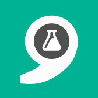
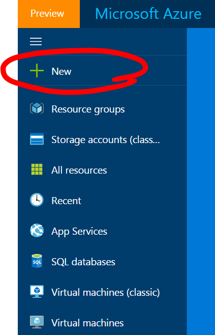
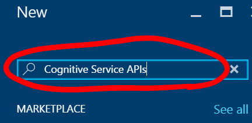
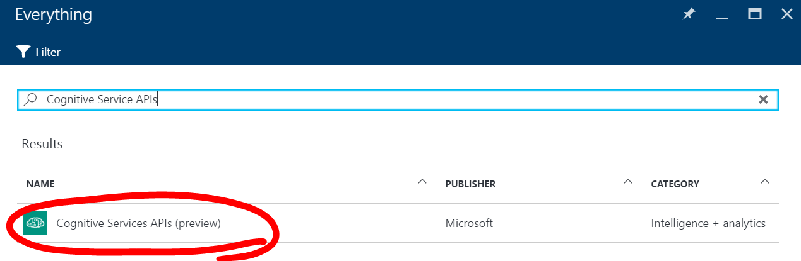
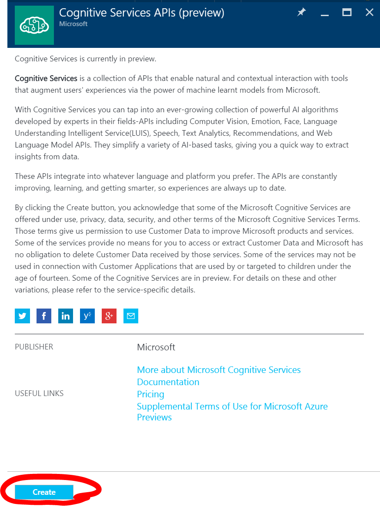
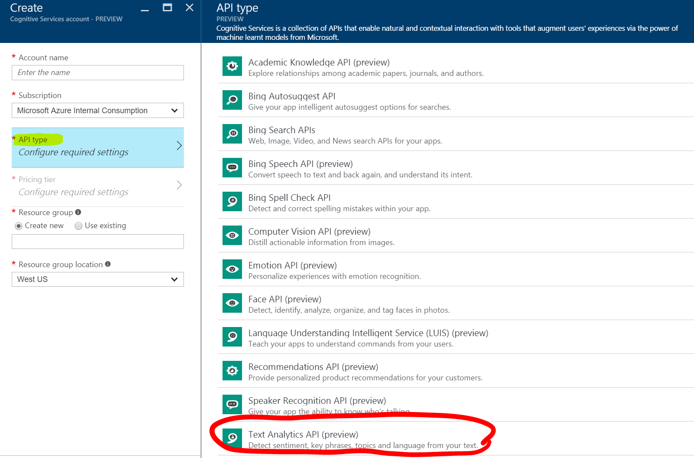
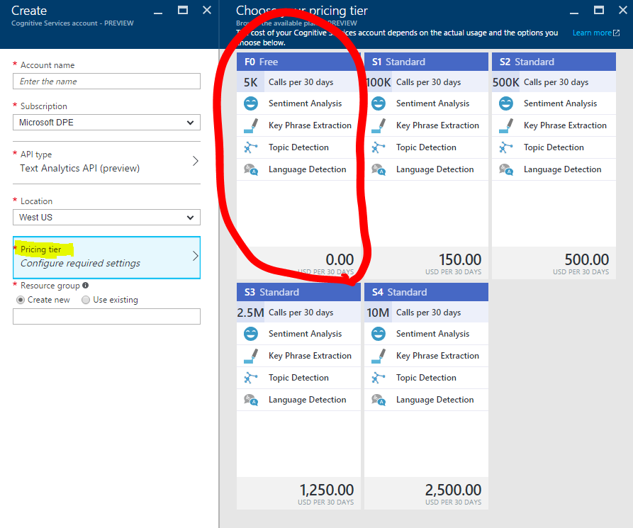
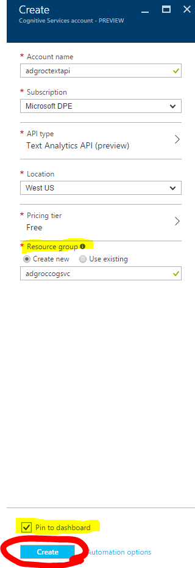
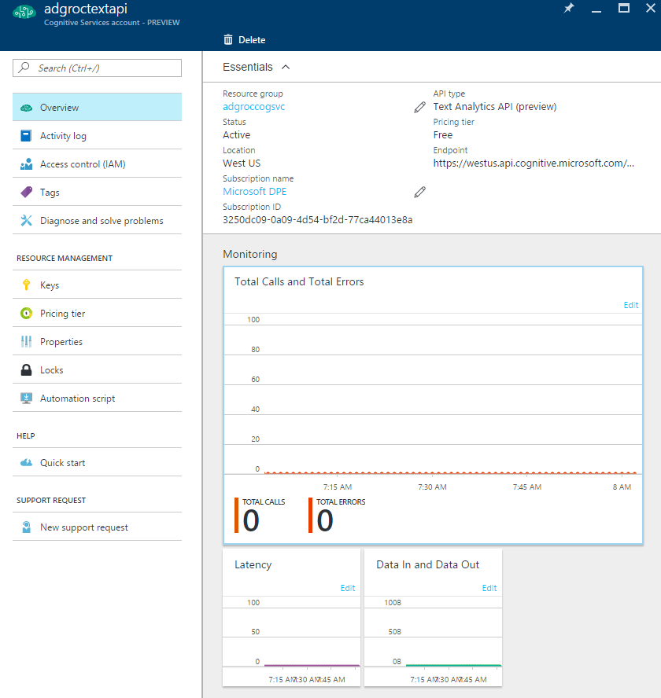
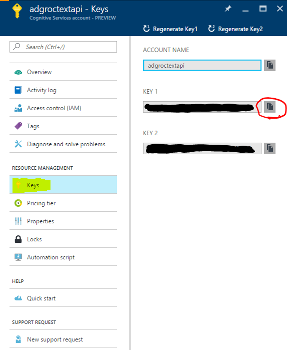

# Getting Started

In order to use the SDK and sample applications you will need an Azure account. If you don't have an Azure account, you can create a free one [here](https://azure.microsoft.com/en-us/free/).

Once you've created your Azure account you'll need to sign up for the Text Analytics API.

1. Navigate to the [Azure management portal](https://portal.azure.com)

2. Click **New**

  

3. Type _Cognitivie Servcies APIs_ in the search field and press _Enter_

  

4. Click _Cognitive Services APIs (preview)_

  

5. Click _Create_

  

6. Enter an _Account name_ and select your _Subscription_

  

7. Click _API type_ and select _Text Analytics API (preview)_

  

8. Click _Pricing tier_ and select the _F0 Free_ tier.

  

9. Create a new resource group or use an existing one, check _Pin to dashboard_, and click _Create_

  

10. After the _Text Analytics API_ has been created, the overview page should launch.

  

11. Click _Keys_ and copy _Key 1_ to the clipboard. You'll need to use this key to run unit tests and/or run the sample application.

  
